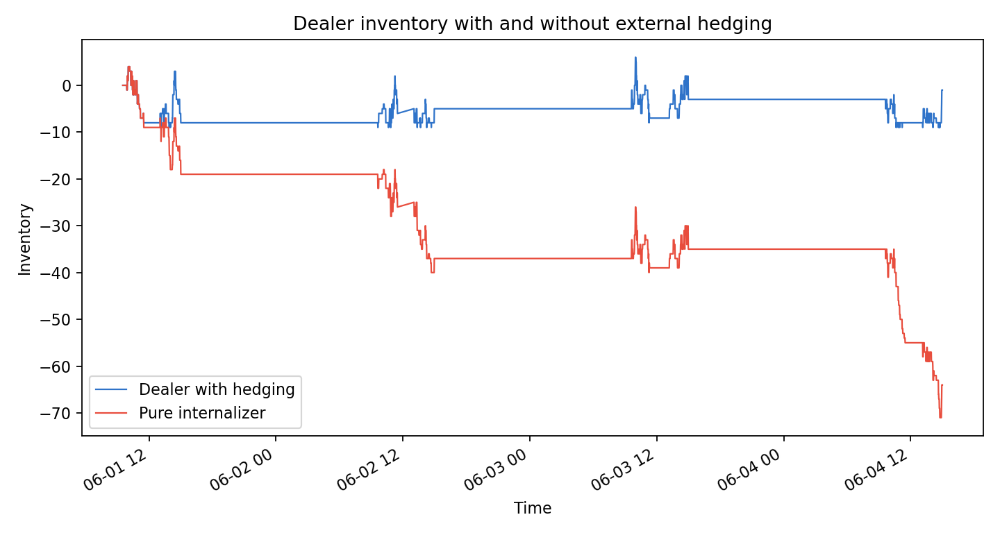
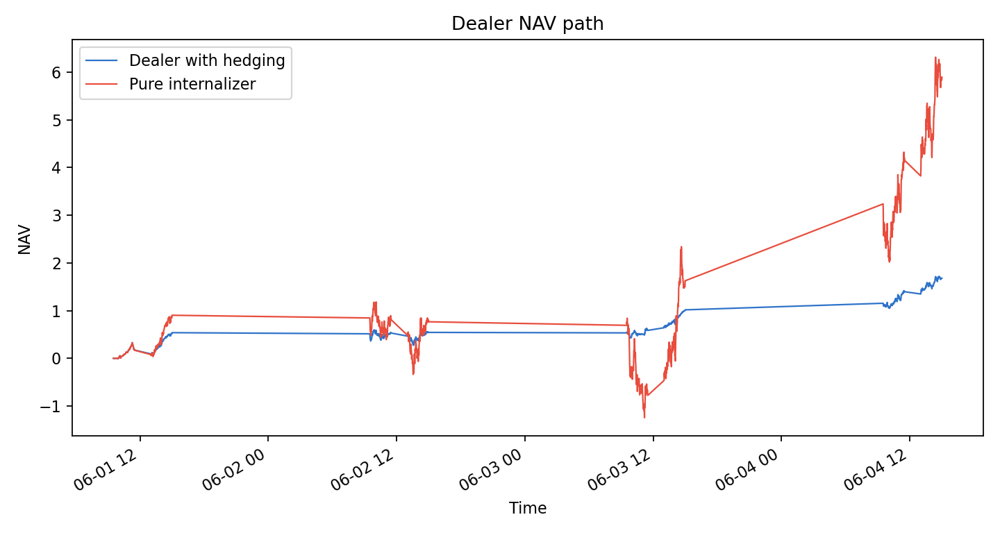

# Dealer Market Making With Hedging | 带外部对冲的做市商模型复现

<p align="center">
  <a href="#中文"></a>
  &nbsp;
  <a href="#english"></a>
</p>

<p align="center">
  
  
  
  
</p>

---

## 中文

### 一句话概览

本项目复现 Barzykin, Bergault 与 Guéant 的前沿论文 **Algorithmic market making in dealer markets with hedging and market impact** 的核心思想：dealer 不必永远只靠客户报价 internalize 库存风险；当库存超出合理区间时，可以通过外部市场对冲，把风险外部化，但要付出市场冲击成本。

使用 Tushare `510300.SH` 沪深 300 ETF 的 1 分钟数据做代理回测。窗口为 `2026-06-01 09:30:00` 到 `2026-06-04 15:00:00`，共 964 条分钟 bar。带 hedge 的 dealer 库存标准差为 **3.18**，低于纯 internalizer 的 **17.73**；NAV 波动为 **0.46**，低于纯 internalizer 的 **1.80**。代价是最终 NAV 从 **5.89** 降至 **1.68**。

### 快速导航

| 你想看什么 | 入口 |
|---|---|
| 文献来源 | [文献来源](#文献来源) |
| 模型定位 | [模型定位](#模型定位) |
| 数据设定 | [数据与市场设定](#数据与市场设定) |
| 回测结果 | [最新结果](#最新结果) |
| 运行命令 | [快速开始](#快速开始) |

### 文献来源

| 条目 | 内容 |
|---|---|
| 论文 | Alexander Barzykin, Philippe Bergault, Olivier Guéant, "Algorithmic market making in dealer markets with hedging and market impact" |
| 入口 | https://arxiv.org/abs/2106.06974 |
| 选择理由 | 前沿 dealer market-making 扩展，把库存风险控制从“报价偏斜”推进到“外部对冲 + 市场冲击” |

### 研究问题

> dealer 什么时候应继续 internalize 客户流，什么时候应去外部市场 hedge 库存？

### 模型定位

| 模块 | 作用 |
|---|---|
| 客户报价 | dealer 对客户买卖需求提供 bid/ask |
| 库存偏斜 | 库存越偏，报价越倾向于吸引反向客户流 |
| hedge band | 库存在阈值内 internalize，超过阈值后外部对冲 |
| 市场冲击 | hedge 越大，成本越高 |
| 基准 | 纯 internalizer，不进行外部 hedge |

### 方法摘要

| 步骤 | 实现 |
|---|---|
| 数据 | Tushare `pro_bar(freq='1min')` ETF 分钟 bar |
| 客户流 | 随机方向与随机手数的客户交易代理 |
| 报价 | half-spread + inventory skew |
| 对冲 | 超过库存阈值后按比例外部化 |
| 成本 | hedge 执行带线性市场冲击成本 |

### 数据与市场设定

| 字段 | 数值 |
|---|---:|
| 标的 | `510300.SH` 沪深 300 ETF |
| 窗口 | `2026-06-01 09:30:00` 至 `2026-06-04 15:00:00` |
| 分钟观测数 | 964 |
| Level2 | 不可用，当前为分钟 bar + 客户流代理 |
| hedge 阈值 | 8 |
| hedge 比例 | 55% 的超额库存 |

### 复现设计

本项目满足至少分钟级回测要求，但不是 Level2。Tushare 分钟数据没有真实客户询价、dealer quote、inter-dealer hedge 成交和盘口深度，因此本项目复现的是论文机制：库存在区间内靠报价 internalize，区间外使用外部 hedge 降风险。

### 最新结果

| 策略 | 最终 NAV | NAV std | 库存均值 | 库存 std | 平均绝对库存 | 客户成交 | hedge 次数 |
|---|---:|---:|---:|---:|---:|---:|---:|
| 带 hedge 的 dealer | 1.68 | **0.46** | -4.81 | **3.18** | **5.14** | 210 | 54 |
| 纯 internalizer | **5.89** | 1.80 | -30.20 | 17.73 | 30.35 | 210 | 0 |

结果解释：外部 hedge 降低库存风险和 NAV 波动，但牺牲短窗口利润。这个风险-收益取舍正是论文的核心机制。

### 关键图表

<p align="center"></p>

<p align="center"></p>

### 稳健性与边界

| 边界 | 说明 |
|---|---|
| 不是 Level2 | 无真实订单簿深度、客户 RFQ、hedge 成交簿 |
| 客户流是代理 | 用随机流模拟 dealer 客户到达 |
| 市场冲击简化 | 使用线性冲击成本，不是完整最优控制 |
| 结果解释重风险 | final NAV 不能单独代表模型好坏 |

### 项目结构

```text
.
|-- src/dealer_model.py
|-- scripts/run_research_pipeline.py
|-- data/raw/
|-- data/processed/
|-- results/tables/
|-- results/figures/
|-- references/source.md
`-- tests/
```

### 快速开始

```bash
pip install -r requirements.txt

python scripts/run_research_pipeline.py \
  --ts-code 510300.SH \
  --start-date 20260601 \
  --end-date 20260605

python -m pytest -q
```

---

## English

### At A Glance

This project reproduces the core idea of Barzykin, Bergault, and Guéant, **Algorithmic market making in dealer markets with hedging and market impact**: a dealer can internalize client flow inside an inventory band, but externalize inventory through hedging once the position becomes too large.

On 964 Tushare one-minute bars for `510300.SH`, the hedging dealer reduces inventory standard deviation to **3.18** versus **17.73** for a pure internalizer. NAV volatility falls to **0.46** versus **1.80**, while final NAV is lower because hedging pays market-impact costs.

### Navigation

| Looking for | Section |
|---|---|
| Source | [Source](#source) |
| Model | [Model Positioning](#model-positioning) |
| Data | [Data And Market Setup](#data-and-market-setup) |
| Results | [Latest Results](#latest-results) |
| Commands | [Quick Start](#quick-start) |

### Source

| Item | Detail |
|---|---|
| Paper | Alexander Barzykin, Philippe Bergault, Olivier Guéant, "Algorithmic market making in dealer markets with hedging and market impact" |
| URL | https://arxiv.org/abs/2106.06974 |
| Why this paper | A frontier extension from inventory-skewed quoting to external hedging with market impact |

### Research Question

> When should a dealer keep internalizing client flow, and when should it hedge inventory externally?

### Model Positioning

| Component | Role |
|---|---|
| Client quotes | Dealer provides bid/ask to client flow |
| Inventory skew | Quotes are adjusted to attract offsetting flow |
| Hedge band | Internalize inside the band, hedge outside |
| Market impact | External hedging has execution cost |
| Benchmark | Pure internalizer without external hedging |

### Method Summary

| Step | Implementation |
|---|---|
| Data | Tushare one-minute ETF bars |
| Client flow | Random direction and random size proxy |
| Quotes | Half-spread plus inventory skew |
| Hedging | Proportional externalization above threshold |
| Costs | Linear market-impact proxy |

### Data And Market Setup

| Field | Value |
|---|---:|
| Asset | `510300.SH` CSI 300 ETF |
| Window | `2026-06-01 09:30:00` to `2026-06-04 15:00:00` |
| Minute bars | 964 |
| Level2 | Not available; this is a minute-bar and client-flow proxy |
| Hedge threshold | 8 |
| Hedge fraction | 55% of excess inventory |

### Reproduction Design

The project uses minute-level data as required, but it is not a Level2 dealer-market replay. The purpose is to reproduce the mechanism: quote skew within the internalization band, and external hedging outside the band.

### Latest Results

| Strategy | Final NAV | NAV Std | Inventory Mean | Inventory Std | Mean Abs Inventory | Client Fills | Hedge Trades |
|---|---:|---:|---:|---:|---:|---:|---:|
| Dealer with hedging | 1.68 | **0.46** | -4.81 | **3.18** | **5.14** | 210 | 54 |
| Pure internalizer | **5.89** | 1.80 | -30.20 | 17.73 | 30.35 | 210 | 0 |

### Key Figures

<p align="center"></p>

<p align="center"></p>

### Robustness And Boundaries

| Boundary | Explanation |
|---|---|
| Not Level2 | No true order book, RFQ, or inter-dealer execution data |
| Client flow is proxied | Random client flow stands in for real dealer requests |
| Impact is simplified | Linear impact proxy, not the full control solution |
| Risk result matters most | Final NAV alone does not evaluate the model |

### Repository Structure

```text
.
|-- src/dealer_model.py
|-- scripts/run_research_pipeline.py
|-- data/
|-- results/
|-- references/
`-- tests/
```

### Quick Start

```bash
pip install -r requirements.txt
python scripts/run_research_pipeline.py --ts-code 510300.SH --start-date 20260601 --end-date 20260605
python -m pytest -q
```

---

## License

MIT-style research reproduction. Add a formal license file before public reuse.
